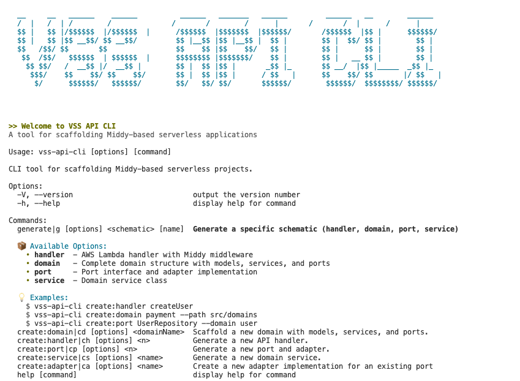

# Introduction

A CLI tool for scaffolding API projects with hexagonal architecture. This tool helps you quickly generate handlers, domains, ports, and services following clean architecture best practices.



## Installation

### Global Installation

```bash 
npm install -g vss-api-cli
```

### Local Installation

```bash
npm install --save-dev vss-api-cli
```

## Usage

The CLI provides specific commands to generate different components:

```bash
vss-api-cli create:<component> <name> [options]
```

You can also use the shorthand aliases for each command:

```bash
vss-api-cli <alias> <name> [options]
```

See the [Commands](/commands/handler) section for details on available commands.

Refer to the [Architecture](/architecture) page for details on the generated project structure.

## Contributing

Contributions are welcome! Please feel free to submit a Pull Request.

## License

This project is licensed under the MIT License.
